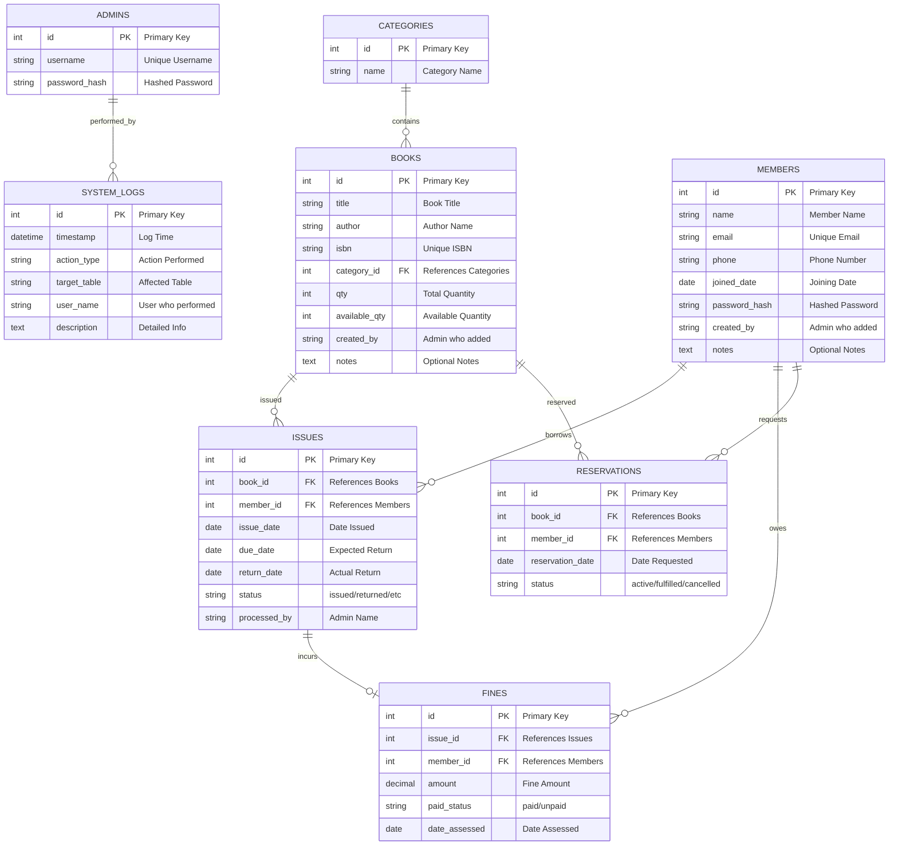

# Entity Relationship Diagram (ERD)

This document provides the ER diagram for the Library Management System database.

## Database Schema Diagram

## Relationships Summary

1.  **Categories to Books**: Each category can contain multiple books.
2.  **Books to Issues**: A book can be issued multiple times over its lifetime.
3.  **Members to Issues**: A member can borrow multiple books.
4.  **Issues to Fines**: An issue may result in at most one fine if returned late.
5.  **Members to Fines**: A member can have multiple fines across different issues.
6.  **Books to Reservations**: Multiple members can reserve the same book if unavailable.
7.  **Members to Reservations**: A member can make multiple reservations.
8.  **System Logs**: Tracks actions performed across various tables, usually associated with an admin's username.
